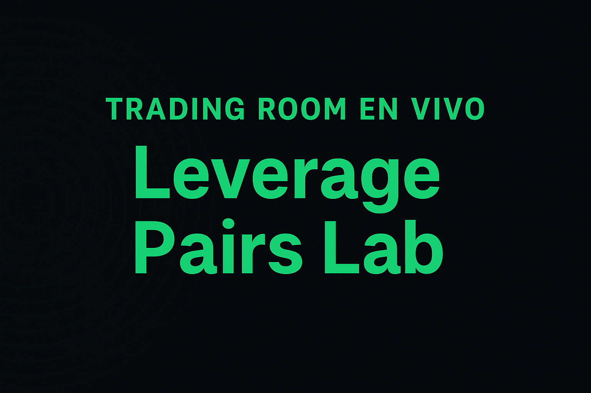
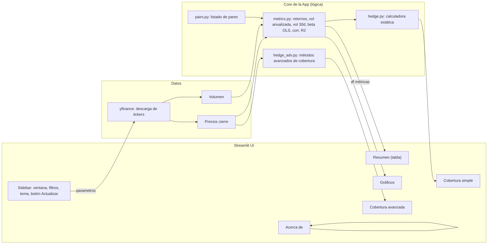
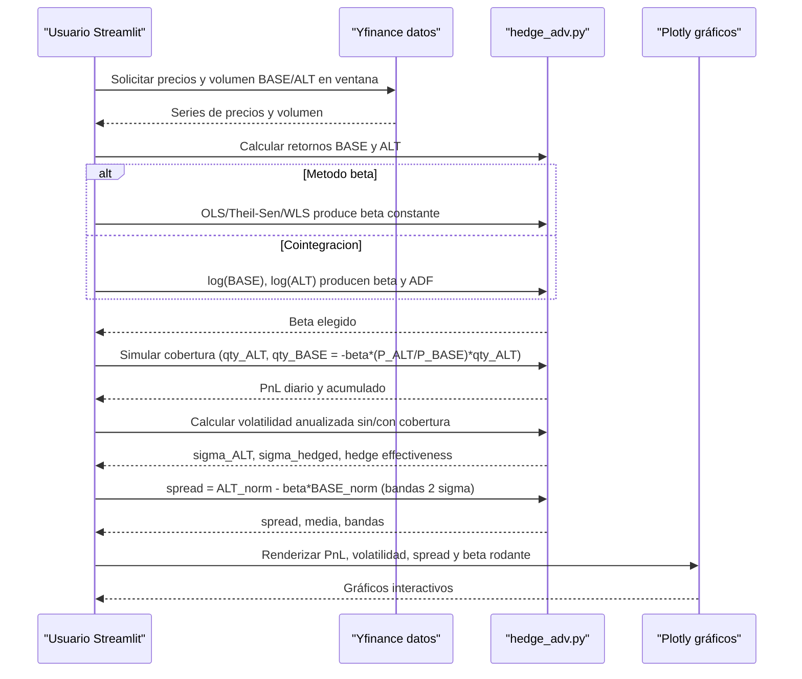
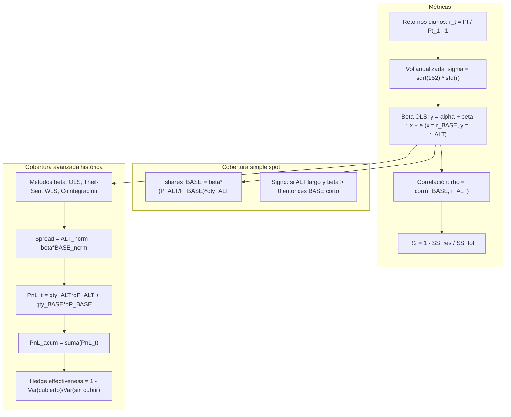

<p align="center">
  
</p>

# Leveraged Pairs Lab — v7 (Trading Room en Vivo Edition)

Aplicación **Streamlit** para análisis cuantitativo de **pares apalancados** (ETF/acciones 2x–3x).  
Compara rendimientos, volatilidades, correlaciones, betas efectivas y simula cobertura simple y avanzada (beta OLS / Theil–Sen / WLS / cointegración).

---

## Instalación y ejecución

```bash
pip install -r requirements.txt
streamlit run app/streamlit_app.py
```

---

## Arquitectura y flujo general de la app



---

## Flujo específico: Cobertura avanzada



---

## Cálculos clave (resumen)



---

## Autor / Contacto

**Edwin Londoño — Trading Room en Vivo**  
📧 edwin@tradingroomenvivo.com  
📺 [YouTube: Trading Room en Vivo](https://www.youtube.com/@tradingRoomenVivo)  
🌐 [tradingroomenvivo.com](https://www.tradingroomenvivo.com)
