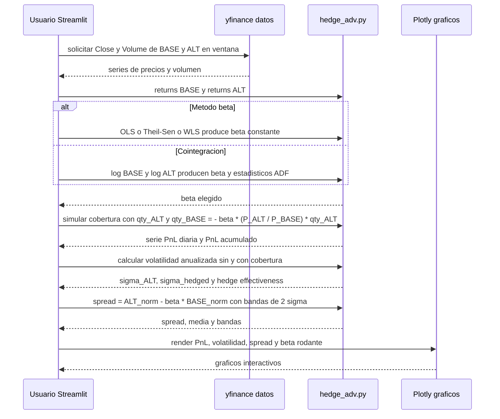

<p align="center">
  
</p>

# Leveraged Pairs Lab — v7 (Trading Room en Vivo Edition)

Aplicación **Streamlit** para análisis cuantitativo de **pares apalancados** (ETF/acciones 2x–3x).  
Compara rendimientos, volatilidades, correlaciones, betas efectivas y simula cobertura simple y avanzada (beta OLS / Theil–Sen / WLS / cointegración).

---

## Instalación y ejecución

```bash
pip install -r requirements.txt
streamlit run app/streamlit_app.py
```

---

## Arquitectura y flujo general de la app

```mermaid
flowchart LR
  subgraph UI[Streamlit UI]
    SI[Sidebar: ventana, filtros, tema, boton Actualizar]
    T1[Resumen (tabla)]
    T2[Graficos]
    T3[Cobertura simple]
    T4[Cobertura avanzada]
    T5[Acerca de]
  end

  subgraph Core[Core de la App (logica)]
    P[pairs.py: listado de pares (BASE-ALT, target_ratio, emisor, nota)]
    M[metrics.py: retornos, vol anualizada, volumen 30d, beta OLS, corr, R2]
    H[hedge.py: calculadora estatica - shares_BASE = beta * (P_ALT / P_BASE) * qty_ALT]
    HA[hedge_adv.py: beta OLS Theil-Sen WLS cointegracion, beta rodante, simulador PnL, hedge effectiveness]
  end

  subgraph Data[Datos]
    YF[yfinance: download(tickers, start, end)]
    C1[Close: series por ticker]
    V1[Volume: series por ticker]
  end

  SI -->|parametros| YF
  YF --> C1
  YF --> V1
  C1 --> M
  V1 --> M
  P --> M
  M -->|dataframe de metricas| T1

  M --> T2
  M --> H
  H --> T3

  C1 --> HA
  HA --> T4

  T5 --> T5
```

---

## Flujo específico: Cobertura avanzada



---

## Cálculos clave (resumen)

```mermaid
flowchart TB
  subgraph Metricas
    R1[Retornos diarios: r_t = Pt / Pt_1 - 1]
    V1[Vol anualizada: sigma = sqrt(252) * std(r)]
    B1[Beta OLS: y = alpha + beta * x + e ; x = r_BASE ; y = r_ALT]
    C1[Correlacion: rho = corr(r_BASE, r_ALT)]
    R2[R2 = 1 - SS_res / SS_tot]
  end

  subgraph SimpleHedge[Cobertura simple spot]
    H1[shares_BASE = beta * (P_ALT / P_BASE) * qty_ALT]
    S1[Signo: si ALT largo y beta > 0 entonces BASE corto]
  end

  subgraph Avanzado[Cobertura avanzada historica]
    A1[Metodos de beta: OLS Theil-Sen WLS Cointegracion]
    A2[Spread = ALT_norm - beta * BASE_norm]
    A3[PnL_t = qty_ALT * dP_ALT + qty_BASE * dP_BASE]
    A4[PnL_acum = suma(PnL_t)]
    A5[Hedge effectiveness = 1 - Var(covered) / Var(unhedged)]
  end

  R1 --> V1 --> B1 --> C1 --> R2
  B1 --> H1
  B1 --> A1
  A1 --> A2 --> A3 --> A4 --> A5
```

---

## Autor / Contacto

**Edwin Londoño — Trading Room en Vivo**  
📧 edwin@tradingroomenvivo.com  
📺 [YouTube: Trading Room en Vivo](https://www.youtube.com/@tradingRoomenVivo)  
🌐 [tradingroomenvivo.com](https://www.tradingroomenvivo.com)
