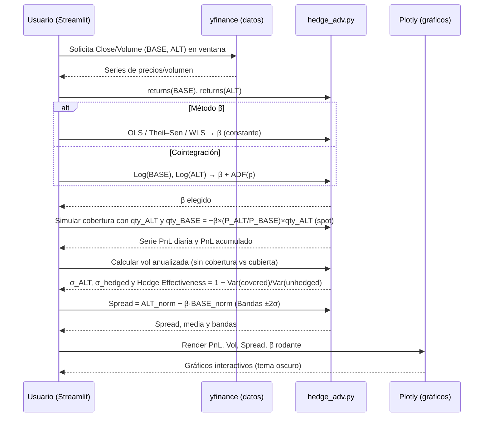

<p align="center">
  
</p>

# Leveraged Pairs Lab — v7 (Trading Room en Vivo Edition)

Aplicación **Streamlit** para análisis cuantitativo de **pares apalancados** (ETF/acciones 2x–3x).  
Compara rendimientos, volatilidades, correlaciones, **betas efectivas** y simula **cobertura simple** y **cobertura avanzada** (β OLS / Theil–Sen / WLS / Cointegración).

---

## 🚀 Instalación y ejecución

```bash
pip install -r requirements.txt
streamlit run app/streamlit_app.py
```

---

## 🧩 Arquitectura y flujo general de la app

```mermaid
flowchart LR
  subgraph UI[Streamlit UI]
    SI[Sidebar<br/>• Ventana<br/>• Filtros emisores/bases<br/>• Tema oscuro<br/>• Botón Actualizar]
    T1[📊 Resumen (tabla)]
    T2[📈 Gráficos]
    T3[🛡️ Cobertura simple]
    T4[🧠 Cobertura avanzada]
    T5[ℹ️ Acerca de]
  end

  subgraph Core[Core de la App (lógica)]
    P[pairs.py<br/>Listado de pares (BASE→ALT,<br/>target_ratio, emisor, nota)]
    M[metrics.py<br/>• Retornos<br/>• Vol anualizada<br/>• Volumen 30d<br/>• Beta OLS<br/>• Corr/R²]
    H[hedge.py<br/>• Calculadora estática<br/>shares_BASE = β·(P_ALT/P_BASE)·qty_ALT]
    HA[hedge_adv.py<br/>• β OLS / Theil–Sen / WLS / Cointegración<br/>• β rodante<br/>• Simulador PnL<br/>• Hedge Effectiveness]
  end

  subgraph Data[Datos]
    YF[yfinance<br/>download(tickers, start, end)]
    C1[Close (series por ticker)]
    V1[Volume (series por ticker)]
  end

  SI -->|Parámetros| YF
  YF --> C1
  YF --> V1
  C1 --> M
  V1 --> M
  P --> M
  M -->|DataFrame de métricas| T1

  %% Gráficos
  M -->|Métricas| T2
  T2 -->|Lollipop β vs target| T2
  T2 -->|Desviación β| T2
  T2 -->|Riesgo–Retorno (burbujas)| T2
  T2 -->|Retornos acumulados ALT| T2
  T2 -->|Retornos acumulados BASE vs ALT| T2
  T2 -->|β rodante| T2

  %% Cobertura
  M --> H
  H -->|resultado spot| T3

  %% Avanzado
  C1 --> HA
  HA -->|β método elegido| T4
  HA -->|Spread ALT − β·BASE| T4
  HA -->|PnL acumulado & Vol cubierta| T4
  HA -->|Hedge Effectiveness| T4

  %% About
  T5 -->|Autor & Contacto| T5
```
  
---

## 🧠 Flujo específico: *Cobertura avanzada*



---

## 📐 Cálculos clave (resumen)

```mermaid
flowchart TB
  subgraph Métricas
    R1[Retornos diarios r_t = P_t / P_{t-1} − 1]
    V1[Vol anualizada σ = √252 · std(r)]
    B1[β (OLS): y = α + βx + ε<br/>x=r_BASE, y=r_ALT]
    C1[Corr: ρ = corr(r_BASE, r_ALT)]
    R2[R² = 1 − SS_res/SS_tot]
  end

  subgraph SimpleHedge[ Cobertura simple (spot) ]
    H1[shares_BASE = β · (P_ALT / P_BASE) · qty_ALT]
    S1[Signo: si ALT largo y β>0 ⇒ BASE corto]
  end

  subgraph Avanzado[ Cobertura avanzada (histórica) ]
    A1[β método: OLS / Theil–Sen / WLS / Cointegración]
    A2[Spread = ALT_norm − β·BASE_norm]
    A3[PnL_t = qty_ALT·ΔP_ALT + qty_BASE·ΔP_BASE]
    A4[PnL_acum = Σ PnL_t]
    A5[Hedge Effectiveness = 1 − Var(covered)/Var(unhedged)]
  end

  R1 --> V1 --> B1 --> C1 --> R2
  B1 --> H1
  B1 --> A1
  A1 --> A2 --> A3 --> A4 --> A5
```

---

## ✨ Características destacadas
- **Tabla de métricas** con β efectiva, target, correlación, R², retornos, volatilidad y volúmenes 30d.
- **Gráficos interactivos** (Plotly, tema oscuro) con control de color por desviación de β, correlación, emisor o bull/bear.
- **Cobertura avanzada** con PnL simulado, comparación de volatilidad cubierta vs sin cobertura y **spread** con bandas ±2σ.
- **Descarga CSV** de métricas para análisis externo.

---

## ℹ️ Autor / Contacto
**Edwin Londoño — Trading Room en Vivo**  
📧 tradingroomenvivo@gmail.com  
📺 YouTube: https://www.youtube.com/@tradingRoomenVivo  
🌐 https://www.tradingroomenvivo.com

---

## 🔒 Licencia (ejemplo restrictivo, puedes cambiarla)
```
Copyright (c) 2025 Edwin Londoño

Se permite el uso con fines educativos y de investigación. 
No se permite la redistribución ni la modificación pública sin autorización expresa del autor.
```
