<p align="center">
  
</p>

# Leveraged Pairs Lab — v7 (Trading Room en Vivo Edition)


Aplicación **Streamlit** para análisis cuantitativo de **pares apalancados** (ETF/acciones 2x–3x).  
Compara rendimientos, volatilidades, correlaciones, betas efectivas y simula cobertura simple y avanzada (beta OLS / Theil–Sen / WLS / cointegración).

---

## 🚀 Demo en vivo
👉 [**Abrir aplicación en Streamlit Cloud**](https://tradingroomenvivo-etfsapalancados.streamlit.app/)

---

## 📘 Contenidos
- [Instalación y ejecución](#instalación-y-ejecución)
- [Arquitectura y flujo general](#arquitectura-y-flujo-general)
- [Flujo de cobertura avanzada](#flujo-de-cobertura-avanzada)
- [Cálculos clave](#cálculos-clave)
- [Problemas comunes](#problemas-comunes)
- [Autor / Contacto](#autor--contacto)
- [Licencia](#licencia)
- [Cita](#cita)

---

## Instalación y ejecución

```bash
pip install -r requirements.txt
streamlit run app/streamlit_app.py
```
### Requisitos mínimos

```
streamlit>=1.38
yfinance>=0.2.40
pandas>=2.2.2
numpy>=1.26.4
scipy>=1.11.4
statsmodels>=0.14.2
matplotlib>=3.8.0
scikit-learn>=1.4.2
plotly>=5.22.0
```

---

## Arquitectura y flujo general


---

## Flujo de cobertura avanzada

```mermaid
sequenceDiagram
  participant UI as "Usuario Streamlit"
  participant DL as "Yfinance datos"
  participant HA as "hedge_adv.py"
  participant PL as "Plotly gráficos"

  UI->>DL: Solicitar precios y volumen BASE/ALT en ventana
  DL-->>UI: Series de precios y volumen
  UI->>HA: Calcular retornos BASE y ALT

  alt Metodo beta
    UI->>HA: OLS/Theil-Sen/WLS produce beta constante
  else Cointegracion
    UI->>HA: log(BASE), log(ALT) producen beta y ADF
  end
  HA-->>UI: Beta elegido

  UI->>HA: Simular cobertura (qty_ALT, qty_BASE = -beta*(P_ALT/P_BASE)*qty_ALT)
  HA-->>UI: PnL diario y acumulado

  UI->>HA: Calcular volatilidad anualizada sin/con cobertura
  HA-->>UI: sigma_ALT, sigma_hedged, hedge effectiveness

  UI->>HA: spread = ALT_norm - beta*BASE_norm (bandas 2 sigma)
  HA-->>UI: spread, media, bandas

  UI->>PL: Renderizar PnL, volatilidad, spread y beta rodante
  PL-->>UI: Gráficos interactivos

```



---

## Cálculos clave

```mermaid
flowchart TB
  subgraph METRICAS["Métricas"]
    R1["Retornos diarios: r_t = Pt / Pt_1 - 1"]
    V1["Vol anualizada: sigma = sqrt(252) * std(r)"]
    B1["Beta OLS: y = alpha + beta * x + e (x = r_BASE, y = r_ALT)"]
    C1["Correlación: rho = corr(r_BASE, r_ALT)"]
    R2["R2 = 1 - SS_res / SS_tot"]
  end

  subgraph SIMPLE["Cobertura simple spot"]
    H1["shares_BASE = beta*(P_ALT/P_BASE)*qty_ALT"]
    S1["Signo: si ALT largo y beta > 0 entonces BASE corto"]
  end

  subgraph AVZ["Cobertura avanzada histórica"]
    A1["Métodos beta: OLS, Theil-Sen, WLS, Cointegración"]
    A2["Spread = ALT_norm - beta*BASE_norm"]
    A3["PnL_t = qty_ALT*dP_ALT + qty_BASE*dP_BASE"]
    A4["PnL_acum = suma(PnL_t)"]
    A5["Hedge effectiveness = 1 - Var(cubierto)/Var(sin cubrir)"]
  end

  R1 --> V1 --> B1 --> C1 --> R2
  B1 --> H1
  B1 --> A1
  A1 --> A2 --> A3 --> A4 --> A5

```


---

## Problemas comunes

| Error | Causa | Solución |
|-------|--------|-----------|
| `StreamlitDuplicateElementId` | Múltiples gráficos con el mismo `id` | Añadir `key=` único en cada `st.plotly_chart()` |
| `ModuleNotFoundError: core.pairs` | Faltan `__init__.py` o rutas | Asegurar `core/__init__.py` y usar `sys.path.append(os.getcwd())` |
| `NaN en gráficos` | Datos vacíos o `inf` | Rellenar medianas o eliminar `NaN` antes de graficar |
| `LF/CRLF` en Windows | Saltos de línea diferentes | Crear `.gitattributes` con `* text=auto eol=lf` |


---

## Autor / Contacto

👤 **Edwin Londoño — Trading Room en Vivo**  
📧 edwin@tradingroomenvivo.com  
📺 [YouTube: Trading Room en Vivo](https://www.youtube.com/@tradingRoomenVivo)  
🌐 [tradingroomenvivo.com](https://www.tradingroomenvivo.com)

---

## Licencia

📜 Uso educativo/investigación.  
Queda prohibida la redistribución o modificación pública sin autorización del autor.

---

## 📖 Cita

> Edwin Londoño (2025). *Leveraged Pairs Lab — Trading Room en Vivo*.  
> GitHub: [inversionista/Etfs_apalancados](https://github.com/inversionista/Etfs_apalancados)
